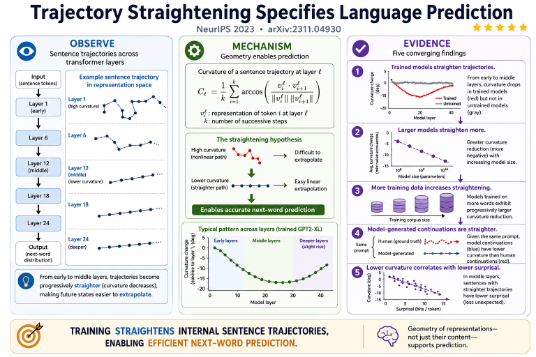

# Predictive Representation Geometry

<a href="https://x.com/dan_hawkley/status/2072218200801259647">Tweet</a>

Computational experiments extending predictive representation geometry through trajectory straightening, curvature-aware objectives, and geometric interventions in transformer language models.
